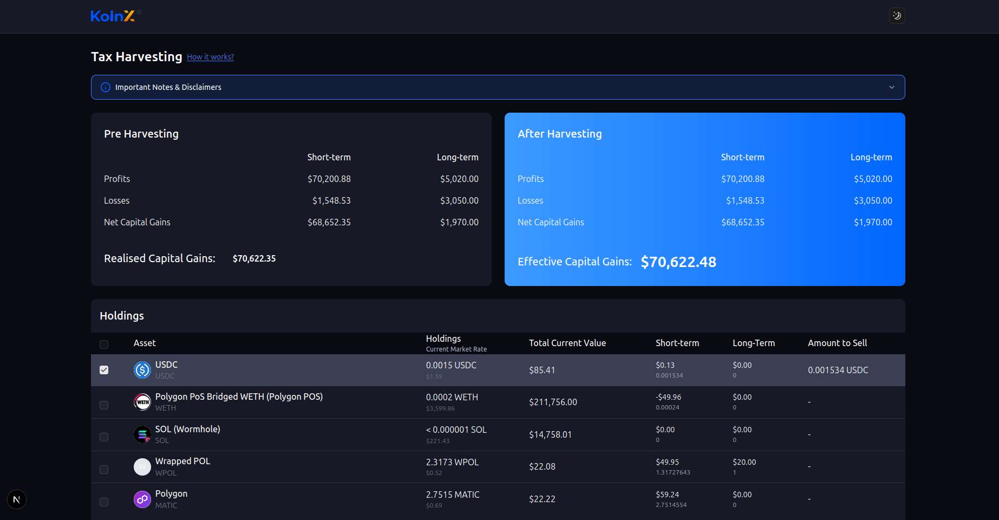
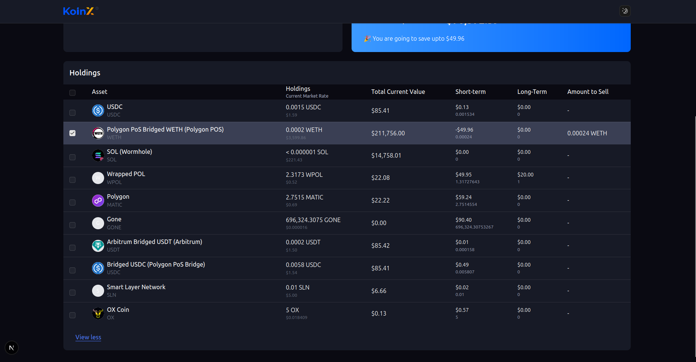
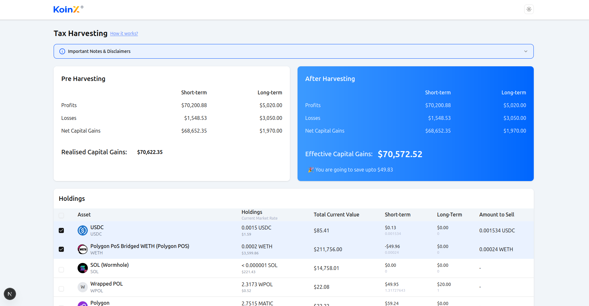
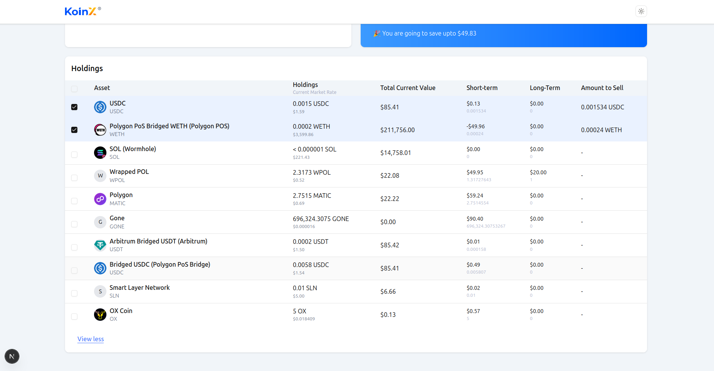

Dinesh Tyagi's KoinX Assignment submission for the Front-END Intern Role 

# 📊 Tax Harvesting Dashboard

This is a [Next.js](https://nextjs.org) project bootstrapped with [`create-next-app`](https://nextjs.org/docs/app/api-reference/cli/create-next-app).

A dashboard for analyzing and optimizing crypto capital gains through tax-loss harvesting, with a clean, modular architecture and responsive UI.

---

## 🚀 Features

✅ **Mobile Responsive UI** – Seamlessly adapts to all screen sizes.
✅ **Reusable Components** – Built with clarity and reusability in mind using a component-driven approach (`/components`).
✅ **State Management with Context API** – Used `useContext` for managing selected holdings (`/Context`).
✅ **Visual Feedback** –

* Hover states on interactive elements
* Row highlighting when selected
  ✅ **Custom Hooks** – API interactions handled using `useCapitalGains` and `useHoldings` hooks for better separation of concerns (`/hooks`).
  ✅ **Loader and Error States** – Display feedback during API calls for better UX.
  ✅ **Deployed on Vercel** –
  🌐 [Live Demo](https://your-vercel-deployment-link.com) *(Replace with actual link)*

---

## 🧭 Getting Started

First, install dependencies and run the development server:

```bash
npm install
npm run dev
# or
yarn dev
```

Visit [http://localhost:3000](http://localhost:3000) to see the app in action.


---

## 🧱 Folder Structure Overview

```
src/
├── app/
│   ├── api/                  # API routes (capital gains, holdings)
│   ├── components/           # UI & functional components
│   ├── Context/              # Global state using React Context
│   ├── hooks/                # Custom hooks for API interactions
│   ├── lib/                  # Utility functions
│   ├── theme/                # Theme toggle and provider setup
│   ├── Types.ts              # Shared TypeScript types

```

---

## 📦 Deployment

Deployed on [Vercel](https://vercel.com).
🔗 **Live Project**: *\[Add your Vercel link here]*

## Dark Mode Screenshots



## Light Mode Screenshots


